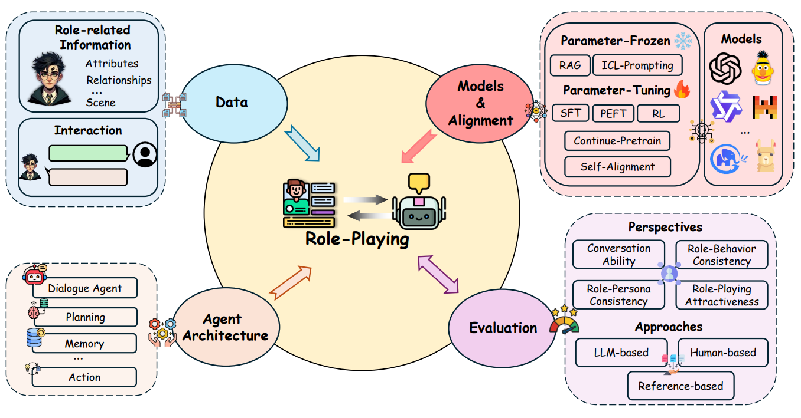

# Awesome-Role Playing-Papers
 
 

 

List of **Papers**, **Datasets** and **Code Repositories** for ***Role-Playing with language models***. This repo contains a majority of research works in the role-playing field, but it still may not encompass all the noteworthy works. 

🚀🚀🚀 Our thoughts and review of  role-playing are in this survey: [**The Oscars of AI Theater: A Survey on Role-Playing with Language Models**](https://arxiv.org/abs/2407.11484).

> If you find we miss some related works or have wrong clarifications, please contact us or open issues!
> 
> This repo is under W.I.P. Please feel free to open issues and make PRs!

### Keywords Convention

 The key contribution  in the work.

 The key contribution  in the work.

 The work is related to Large language models.

## 1. Data

### 1.1 Character-based Role-Playing Datasets:

- **Characteristic AI Agents via Large Language Models**  [[COLING 2024]](https://arxiv.org/abs/2403.12368) [[Code]](https://github.com/nuaa-nlp/Character100)   

   *Xi Wang, Hongliang Dai, Shen Gao, Piji Li*

- **TimeChara: Evaluating Point-in-Time Character Hallucination of Role-Playing Large Language Models**  [[ACL 2024]](https://arxiv.org/abs/2405.18027) [[Code]](https://github.com/ahnjaewoo/timechara)   

   *Jaewoo Ahn, Taehyun Lee, Junyoung Lim, Jin-Hwa Kim, Sangdoo Yun, Hwaran Lee, Gunhee Kim*

- **Evaluating Character Understanding of Large Language Models via Character Profiling from Fictional Works** [[Arxiv]](https://arxiv.org/abs/2404.12726) [[Code]](https://github.com/Joanna0123/character_profiling)   

  *Xinfeng Yuan, Siyu Yuan, Yuhan Cui, Tianhe Lin, Xintao Wang, Rui Xu, Jiangjie Chen, Deqing Yang*

- **Character is Destiny: Can Large Language Models Simulate Persona-Driven Decisions in Role-Playing?** [[Arxiv]](https://arxiv.org/abs/2404.12138)   

  *Rui Xu, Xintao Wang, Jiangjie Chen, Siyu Yuan, Xinfeng Yuan, Jiaqing Liang, Zulong Chen, Xiaoqing Dong, Yanghua Xiao*

- **PIPPA: A Partially Synthetic Conversational Dataset** [[Arxiv]](https://arxiv.org/abs/2308.05884) [[Code]](https://huggingface.co/datasets/PygmalionAI/PIPPA)  

  *Tear Gosling, Alpin Dale, Yinhe Zheng*

- **Rolellm: Benchmarking, eliciting, and enhancing role-playing abilities of large language models.** [[Arxiv]](https://arxiv.org/abs/2310.00746) [[Code]](https://github.com/InteractiveNLP-Team/RoleLLM-public)   

  *Zekun Moore Wang, Zhongyuan Peng, Haoran Que, Jiaheng Liu, Wangchunshu Zhou, Yuhan Wu, Hongcheng Guo, Ruitong Gan, Zehao Ni, Jian Yang, Man Zhang, Zhaoxiang Zhang, Wanli Ouyang, Ke Xu, Stephen W. Huang, Jie Fu, Junran Peng*

- **Character-LLM: A Trainable Agent for Role-Playing** [[emnlp2023]](https://arxiv.org/abs/2310.10158) [[Code]](https://github.com/choosewhatulike/trainable-agents)     

  *Yunfan Shao, Linyang Li, Junqi Dai, Xipeng Qiu*
  
- **RoleInteract: Evaluating the Social Interaction of Role-Playing Agents** [[Arxiv]](https://arxiv.org/abs/2403.13679) [[Code]](https://github.com/X-PLUG/RoleInteract)   

  *Hongzhan Chen, Hehong Chen, Ming Yan, Wenshen Xu, Xing Gao, Weizhou Shen, Xiaojun Quan, Chenliang Li, Ji Zhang, Fei Huang, Jingren Zhou*
  
- **Large Language Models are Superpositions of All Characters: Attaining
Arbitrary Role-play via Self-Alignment** [[Arxiv]](https://arxiv.org/abs/2401.12474) [[Code]](https://github.com/OFA-Sys/Ditto)     

   *Keming Lu, Bowen Yu, Chang Zhou, Jingren Zhou*

- **CharacterEval: A Chinese Benchmark for Role-Playing Conversational Agent Evaluation** [[Arxiv]](https://arxiv.org/abs/2401.01275) [[Code]](https://github.com/morecry/CharacterEval)  

  *Quan Tu, Shilong Fan, Zihang Tian, Rui Yan*

 - **ChatHaruhi: Reviving Anime Character in Reality via Large Language Model** [[Arxiv]](https://arxiv.org/abs/2308.09597) [[Code]](https://github.com/LC1332/Chat-Haruhi-Suzumiya)   

   *Cheng Li, Ziang Leng, Chenxi Yan, Junyi Shen, Hao Wang, Weishi MI, Yaying Fei, Xiaoyang Feng, Song Yan, HaoSheng Wang, Linkang Zhan, Yaokai Jia, Pingyu Wu, Haozhen Sun*

 - **PRODIGy: a PROfile-based DIalogue Generation dataset** [[Arxiv]](https://arxiv.org/abs/2311.05195)    

    *Daniela Occhipinti, Serra Sinem Tekiroglu, Marco Guerini*

- **CharacterGLM: Customizing Chinese Conversational AI Characters with Large Language Models** [[Arxiv]](https://arxiv.org/abs/2311.16832) [[Code]](https://github.com/thu-coai/CharacterGLM-6B)  

    *Jinfeng Zhou, Zhuang Chen, Dazhen Wan, Bosi Wen, Yi Song, Jifan Yu, Yongkang Huang, Libiao Peng, Jiaming Yang, Xiyao Xiao, Sahand Sabour, Xiaohan Zhang, Wenjing Hou, Yijia Zhang, Yuxiao Dong, Jie Tang, Minlie Huang*

- **ChatPLUG: Open-Domain Generative Dialogue System with Internet-Augmented Instruction Tuning for Digital Human** [[Arxiv]](https://arxiv.org/pdf/2304.07849) [[Code]](https://github.com/X-PLUG/ChatPLUG)  

   *Junfeng Tian, Hehong Chen, Guohai Xu, Ming Yan, Xing Gao, Jianhai Zhang, Chenliang Li, Jiayi Liu, Wenshen Xu, Haiyang Xu, Qi Qian, Wei Wang, Qinghao Ye, Jiejing Zhang, Ji Zhang, Fei Huang, Jingren Zhou*

- **Large Language Models Meet Harry Potter: A Bilingual Dataset for Aligning Dialogue Agents with Characters** [[EMNLP2023]](https://arxiv.org/pdf/2211.06869)  [[code]](https://nuochenpku.github.io/HPD.github.io)   

  *Nuo Chen, Yan Wang, Haiyun Jiang, Deng Cai, Yuhan Li, Ziyang Chen, Longyue Wang, Jia Li*

- **Beyond Retrieval: Embracing Compressive Memory in Real-World
Long-Term Conversations** [[Arxiv]](https://arxiv.org/abs/2402.11975) [[code]](https://github.com/nuochenpku/COMEDY)    

  *Nuo Chen, Yan Wang, Haiyun Jiang, Deng Cai, Yuhan Li, Ziyang Chen, Longyue Wang, Jia Li*

- **CharacterChat: Learning towards Conversational AI with Personalized Social Support** [[Arxiv]](https://arxiv.org/abs/2308.10278)  [[code]](https://github.com/morecry/CharacterChat)   

   *Quan Tu, Chuanqi Chen, Jinpeng Li, Yanran Li, Shuo Shang, Dongyan Zhao, Ran Wang, Rui Yan*
  
- **LaMP: When Large Language Models Meet Personalization** [[Arxiv]](https://arxiv.org/abs/2304.11406)    

  *Alireza Salemi, Sheshera Mysore, Michael Bendersky, Hamed Zamani*

### 1.2 Persona-based Role-Playing Datasets:

- **LiveChat: A Large-Scale Personalized Dialogue Dataset Automatically Constructed from Live Streaming.** [[ACL2023]](https://arxiv.org/abs/2306.08401)  [[code]](https://github.com/gaojingsheng/LiveChat)   

  *Jingsheng Gao, Yixin Lian, Ziyi Zhou, Yuzhuo Fu, Baoyuan Wang*

- **When Crowd Meets Persona: Creating a Large-Scale Open-Domain Persona Dialogue Corpus.** [[Arxiv]](https://arxiv.org/abs/2304.00350)   

  *Won Ik Cho, Yoon Kyung Lee, Seoyeon Bae, Jihwan Kim, Sangah Park, Moosung Kim, Sowon Hahn, Nam Soo Kim*

- **RealPersonaChat: A Realistic Persona Chat Corpus with Interlocutors’ Own Personalities.** [[PACLIC2023]](https://aclanthology.org/2023.paclic-1.85/) [[Code]](https://github.com/nu-dialogue/real-persona-chat)   

  *Sanae Yamashita, Koji Inoue, Ao Guo, Shota Mochizuki, Tatsuya Kawahara, Ryuichiro Higashinaka*
  

- **Multimodal Persona Based Generation of Comic Dialogs.** [[ACL2023]](https://aclanthology.org/2023.acl-long.791/) [[Code]](https://github.com/Atenrev/comics-dialogue-generation)   

  *Harsh Agrawal, Aditya Mishra, Manish Gupta, Mausam*
  
- **Enhancing Chat Language Models by Scaling High-quality Instructional Conversations** [[EMNLP2023]](https://arxiv.org/abs/2112.08619/) [[Code]](https://github.com/thunlp/UltraChat)     

  *Ning Ding, Yulin Chen, Bokai Xu, Yujia Qin, Zhi Zheng, Shengding Hu, Zhiyuan Liu, Maosong Sun, Bowen Zhou*

- **MPCHAT: Towards Multimodal Persona-Grounded Conversation** [[ACL2023]](https://aclanthology.org/2023.acl-long.189/)  [[code]](http://vision.snu.ac.kr/projects/mpchat)  
  
  *Jaewoo Ahn, Yeda Song, Sangdoo Yun, Gunhee Kim*

-  **Large Language Models as Source Planner for Personalized Knowledge-grounded Dialogue** [[Arxiv]](https://arxiv.org/abs/2310.08840)     

    *Hongru Wang, Minda Hu, Yang Deng, Rui Wang, Fei Mi, Weichao Wang, Yasheng Wang, Wai-Chung Kwan, Irwin King, Kam-Fai Wong*

- **Long Time No See! Open-Domain Conversation with Long-Term Persona Memory** [[ACL2022]](https://aclanthology.org/2022.findings-acl.207/)  [[code]](https://github.com/PaddlePaddle/Research/tree/master/NLP/ACL2022-DuLeMon)  

    *Xinchao Xu, Zhibin Gou, Wenquan Wu, Zheng-Yu Niu, Hua Wu, Haifeng Wang, Shihang Wang*
  
- **Profile Consistency Identification for Open-domain Dialogue Agents** [[EMNLP2022]](https://aclanthology.org/2020.emnlp-main.539.pdf)   

    *Haoyu Song, Yan Wang, Wei-Nan Zhang, Zhengyu Zhao, Ting Liu, Xiaojiang Liu*

- **Pchatbot: A large-scale dataset for personalized chatbot** [[SIGIR2021]](https://dl.acm.org/doi/abs/10.1145/3404835.3463239)  [[code]](https://github.com/qhjqhj00/Pchatbot)  

    *Hongjin Qian, Xiaohe Li, Hanxun Zhong, Yu Guo, Yueyuan Ma, Yutao Zhu, Zhanliang Liu, Zhicheng Dou, Ji-Rong Wen*

- **Personalized Dialogue Generation with Diversified Traits** [[Arxiv]](https://arxiv.org/abs/1901.09672)   

    *Yinhe Zheng, Guanyi Chen, Minlie Huang, Song Liu, Xuan Zhu*

- **Personalizing Dialogue Agents: I have a dog, do you have pets too?** [[ACL2018]](https://aclanthology.org/P18-1205/)  [[code]](https://github.com/facebookresearch/ParlAI)  

    *Saizheng Zhang, Emily Dinan, Jack Urbanek, Arthur Szlam, Douwe Kiela, Jason Weston*

- **Wizard of Wikipedia: Knowledge-Powered Conversational Agents** [[ICLR2018]](https://openreview.net/forum?id=r1l73iRqKm/)  [[code]](https://paperswithcode.com/dataset/wizard-of-wikipedia)  

    *Emily Dinan, Stephen Roller, Kurt Shuster, Angela Fan, Michael Auli, Jason Weston*

- **FriendsQA: Open-Domain Question Answering on TV Show Transcripts** [[SIGDIAL2019]](https://aclanthology.org/W19-5923/)    

    *Zhengzhe Yang, Jinho D. Choi*

- **Call for Customized Conversation: Customized Conversation Grounding Persona and Knowledge** [[Arxiv]](https://arxiv.org/abs/2112.08619/) [[Code]](https://github.com/pkchat-focus/FoCus)    

  *Yoonna Jang, Jungwoo Lim, Yuna Hur, Dongsuk Oh, Suhyune Son, Yeonsoo Lee, Donghoon Shin, Seungryong Kim, Heuiseok Lim*

## 2. Alignment

- **Large Language Models are Superpositions of All Characters: Attaining
Arbitrary Role-play via Self-Alignment** [[Arxiv]](https://arxiv.org/abs/2401.12474) [[Code]](https://github.com/OFA-Sys/Ditto)     

   *Keming Lu, Bowen Yu, Chang Zhou, Jingren Zhou*

- **CharacterGLM: Customizing Chinese Conversational AI Characters with Large Language Models** [[Arxiv]](https://arxiv.org/abs/2311.16832) [[Code]](https://github.com/thu-coai/CharacterGLM-6B)     

    *Jinfeng Zhou, Zhuang Chen, Dazhen Wan, Bosi Wen, Yi Song, Jifan Yu, Yongkang Huang, Libiao Peng, Jiaming Yang, Xiyao Xiao, Sahand Sabour, Xiaohan Zhang, Wenjing Hou, Yijia Zhang, Yuxiao Dong, Jie Tang, Minlie Huang*

- **ChatPLUG: Open-Domain Generative Dialogue System with Internet-Augmented Instruction Tuning for Digital Human** [[Arxiv]](https://arxiv.org/pdf/2304.07849) [[Code]](https://github.com/X-PLUG/ChatPLUG)   

   *Junfeng Tian, Hehong Chen, Guohai Xu, Ming Yan, Xing Gao, Jianhai Zhang, Chenliang Li, Jiayi Liu, Wenshen Xu, Haiyang Xu, Qi Qian, Wei Wang, Qinghao Ye, Jiejing Zhang, Ji Zhang, Fei Huang, Jingren Zhou*

- **Building Persona Consistent Dialogue Agents with Offline Reinforcement Learning** [[EMNLP2023]](https://arxiv.org/pdf/2310.10735)     

   *Ryan Shea, Zhou Yu*

- **P5: Plug-and-Play Persona Prompting for Personalized Response Selection** [[EMNLP2023]](https://arxiv.org/pdf/2310.06390)  [[code]](https://github.com/rungjoo/plug-and-play-prompt-persona)    

   *Joosung Lee, Minsik Oh, Donghun Lee*

- **RECAP: Retrieval-Enhanced Context-Aware Prefix Encoder for Personalized Dialogue Response Generation**  [[ACL2023]](https://aclanthology.org/2023.acl-long.468.pdf)  [[code]](https://github.com/isi-nlp/RECAP)   

  *Shuai Liu, Hyundong Cho, Marjorie Freedman, Xuezhe Ma, Jonathan May*

- **MPCHAT: Towards Multimodal Persona-Grounded Conversation** [[ACL2023]](https://aclanthology.org/2023.acl-long.189/)  [[code]](http://vision.snu.ac.kr/projects/mpchat)   

  *Jaewoo Ahn, Yeda Song, Sangdoo Yun, Gunhee Kim*

- **Marked Personas: Using Natural Language Prompts to Measure Stereotypes in Language Models** [[ACL2023]](https://arxiv.org/abs/2305.18189)   

  *Myra Cheng, Esin Durmus, Dan Jurafsky*

- **Learning to Predict Persona Information for Dialogue Personalization without Explicit Persona Description**  [[ACL2023]](https://aclanthology.org/2023.findings-acl.186/)  
  
    *Wangchunshu Zhou, Qifei Li, Chenle Li*

- **Towards Robust Personalized Dialogue Generation via Order-Insensitive Representation Regularization** [[ACL2023]](https://aclanthology.org/2023.findings-acl.186/) [[Code]](https://github.com/ChanLiang/ORIG)  
  
    *Liang Chen  Hongru Wang  Yang Deng  Wai Chung Kwan  Zezhong Wang  Kam-Fai Wong*

- **Towards Zero-Shot Persona Dialogue Generation with In-Context Learning** [[ACL2023]](https://aclanthology.org/2023.findings-acl.90.pdf)  
  
  *Xinchao Xu, Zeyang Lei, Wenquan Wu, Zheng-Yu Niu, Hua Wu, Haifeng Wang*

- **SimOAP: Improve Coherence and Consistency in Persona-based Dialogue Generation via Over-sampling and Post-evaluation** [[ACL2023]](https://aclanthology.org/2023.acl-long.553.pdf)  
  
   *Junkai Zhou, Liang Pang, Huawei Shen, Xueqi Cheng*

- **Enhancing Personalized Dialogue Generation with Contrastive Latent Variables: Combining Sparse and Dense Persona** [[ACL2023]](https://aclanthology.org/2023.acl-long.299.pdf)   
  
  *Yihong Tang, Bo Wang, Miao Fang, Dongming Zhao, Kun Huang, Ruifang He, Yuexian Hou*

- **CharacterChat: Learning towards Conversational AI with Personalized Social Support** [[Arxiv]](https://arxiv.org/abs/2308.10278)  [[code]](https://github.com/morecry/CharacterChat)   

   *Quan Tu, Chuanqi Chen, Jinpeng Li, Yanran Li, Shuo Shang, Dongyan Zhao, Ran Wang, Rui Yan*

- **Large Language Models as Source Planner for Personalized Knowledge-grounded Dialogue** [[Arxiv]](https://arxiv.org/abs/2310.08840)     

  *Hongru Wang, Minda Hu, Yang Deng, Rui Wang, Fei Mi, Weichao Wang, Yasheng Wang, Wai-Chung Kwan, Irwin King, Kam-Fai Wong*

- **PersonaPKT: Building Personalized Dialogue Agents via Parameter-efficient Knowledge Transfer** [[Arxiv]](https://arxiv.org/abs/2306.08126)   

  *Xu Han, Bin Guo, Yoon Jung, Benjamin Yao, Yu Zhang, Xiaohu Liu, Chenlei Guo*

- **Aligning Language Models to User Opinions** [[Arxiv]](https://arxiv.org/abs/2305.14929)   

  *EunJeong Hwang, Bodhisattwa Prasad Majumder, Niket Tandon*

- **Toxicity in ChatGPT: Analyzing Persona-assigned Language Models** [[Arxiv]](https://arxiv.org/abs/2304.05335)   

    *Ameet Deshpande, Vishvak Murahari, Tanmay Rajpurohit, Ashwin Kalyan, Karthik Narasimhan*
  
- **Learning to Memorize Entailment and Discourse Relations for Persona-Consistent Dialogues** [[AAAI2023]](https://arxiv.org/abs/2301.04871) [[Code]](https://github.com/Chenrj233/LMEDR)    

  *Ruijun Chen, Jin Wang, Liang-Chih Yu, Xuejie Zhang*

- **Improving Personalized Explanation Generation through Visualization** [[ACL2022]](https://aclanthology.org/2022.acl-long.20.pdf)   
  
    *Shijie Geng, Zuohui Fu, Yingqiang Ge, Lei Li, Gerard de Melo, Yongfeng Zhang*

-  **There Are a Thousand Hamlets in a Thousand People’s Eyes: Enhancing Knowledge-grounded Dialogue with Personal Memory** [[ACL2022]](https://aclanthology.org/2022.acl-long.270.pdf)  

   *Tingchen Fu, Xueliang Zhao, Chongyang Tao, Ji-Rong Wen, Rui Yan*

- **Long Time No See! Open-Domain Conversation with Long-Term Persona Memory** [[ACL2022]](https://aclanthology.org/2022.findings-acl.207/)  [[code]](https://github.com/PaddlePaddle/Research/tree/master/NLP/ACL2022-DuLeMon)  

    *Xinchao Xu, Zhibin Gou, Wenquan Wu, Zheng-Yu Niu, Hua Wu, Haifeng Wang, Shihang Wang*

- **A Model-agnostic Data Manipulation Method for Persona-based Dialogue Generation** [[ACL2022]](https://aclanthology.org/2022.acl-long.550.pdf)    
  
    *Yu Cao, Wei Bi, Meng Fang, Shuming Shi, Dacheng Tao*

- **PAIGE: Personalized Adaptive Interactions Graph Encoder for Query Rewriting in Dialogue Systems** [[EMNLP2022]](https://aclanthology.org/2022.emnlp-industry.40.pdf)   

    *Daniel Biś, Saurabh Gupta, Jie Hao, Xing Fan, Chenlei Guo*

-  **AssistSR: Task-oriented Video Segment Retrieval for Personal AI Assistant** [[EMNLP2022]](https://aclanthology.org/2022.findings-emnlp.24.pdf)   
  
   *Weixian Lei, Difei Gao, Yuxuan Wang, Dongxing Mao, Zihan Liang, Lingmin Ran, Mike Zheng Shou*

-  **MCP: Self-supervised Pre-training for Personalized Chatbots with Multi-level Contrastive Sampling** [[EMNLP2022]](https://aclanthology.org/2022.findings-emnlp.73.pdf)   
  
    *Zhaoheng Huang, Zhicheng Dou, Yutao Zhu, Zhengyi Ma*

- **Persona-Based Conversational AI: State of the Art and Challenges** [[ICDMW2022]](https://arxiv.org/abs/2212.03699)   

    *Junfeng Liu, Christopher Symons, Ranga Raju Vatsavai*

- **Less is More: Learning to Refine Dialogue History for Personalized Dialogue Generation** [[NAACL2022]](https://arxiv.org/abs/2204.08128)   

    *Hanxun Zhong, Zhicheng Dou, Yutao Zhu, Hongjin Qian, Ji-Rong Wen*

- **COSPLAY: Concept Set Guided Personalized Dialogue Generation Across Both Party Personas** [[SIGIR2022]](https://dl.acm.org/doi/10.1145/3477495.3531957) [[Code]](https://github.com/chenxu05037/COSPLAY) 

    *Chen Xu, Piji Li, Wei Wang, Haoran Yang, Siyun Wang, Chuangbai Xiao*

- **BoB: BERT Over BERT for Training Persona-based Dialogue Models from Limited Personalized Data** [[ACL2021]](https://aclanthology.org/2021.acl-long.14.pdf)  [[code]](https://github.com/songhaoyu/BoB) 

     *Haoyu Song, Yan Wang, Kaiyan Zhang, Wei-Nan Zhang, Ting Liu*

## 3. Role-Playing Language Model Agents (RPLAs)

- **Unleashing the Emergent Cognitive Synergy in Large Language Models: A Task-Solving Agent through Multi-Persona Self-Collaboration** [[NAACL2024]](https://aclanthology.org/2024.naacl-long.15/) [[Code]](https://github.com/MikeWangWZHL/Solo-Performance-Prompting.git)  

   *Zhenhailong Wang, Shaoguang Mao, Wenshan Wu, Tao Ge, Furu Wei, Heng Ji*

- **HoLLMwood: Unleashing the Creativity of Large Language Models in Screenwriting via Role Playing** [[Arxiv]](https://arxiv.org/abs/2406.11683)    

   *Jing Chen, Xinyu Zhu, Cheng Yang, Chufan Shi, Yadong Xi, Yuxiang Zhang, Junjie Wang, Jiashu Pu, Rongsheng Zhang, Yujiu Yang, Tian Feng*

- **On the Decision-Making Abilities in Role-Playing using Large Language Models** [[Arxiv]](https://arxiv.org/abs/2402.18807)    

   *Chenglei Shen, Guofu Xie, Xiao Zhang, Jun Xu*
  

- **Generative Agents: Interactive Simulacra of Human Behavior** [[UIST23]](https://arxiv.org/abs/2304.03442)  [[Code]](https://github.com/mkturkcan/generative-agents)   

   *Joon Sung Park, Joseph C. O'Brien, Carrie J. Cai, Meredith Ringel Morris, Percy Liang, Michael S. Bernstein*

- **Humanoid Agents: Platform for Simulating Human-like Generative Agents** [[EMNLP2023]](https://aclanthology.org/2023.emnlp-demo.15.pdf)  [[Code]](https://github.com/HumanoidAgents/HumanoidAgents)   

   *Zhilin Wang, Yu Ying Chiu, Yu Cheung Chiu*

- **Language models show human-like content effects on reasoning tasks** [[PNAS Nexus]](https://arxiv.org/abs/2207.07051)    

   *Ishita Dasgupta, Andrew K. Lampinen, Stephanie C. Y. Chan, Hannah R. Sheahan, Antonia Creswell, Dharshan Kumaran, James L. McClelland, Felix Hill*

